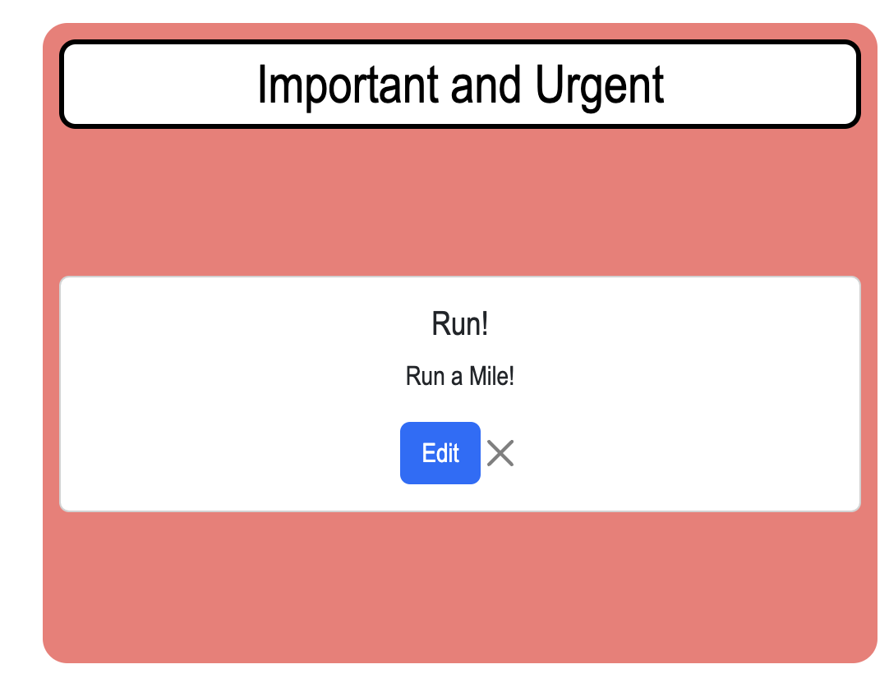

# Organizablilty App

## Overview

This website was created for the first group project of the ed-X Coding Bootcamp. It operates as a productivity/organizational tool. Tasks can be assigned and divided into four categories: Important and Urgent, Important but Not Urgent, Not Urgent but Important, and Not Important and Not Urgent. We decided early on we wanted to make an organizational tool with an emphasis on task management and note-taking. Having a single page where different tasks could be easily sorted was more important to us than designing something with robust calendar or planner functionality, although that is something we might pursue should we decide to keep working on this project. 

LIVE LINK: https://samvs-tech.github.io/Organizability/

## Technologies Used

Organizability was built using HTML, CSS, and JavaScript.

## Features and Usage

Organizability can be used within the browser, and it makes use of local storage.

- A banner at the top of the page displays the current date, two navigational arrows that allow users to cycle through past and future dates, and a random "suggested task." 

- The four aforementioned task categories are represented as different-colored boxes. Using the add task feature, you can assign tasks to one of the four boxes.

- You can name the task and also include a task description when adding a new task. Both the task name and task description are displayed on the page. You can also delete, edit, and reassign tasks once they've been added to the page.

- The browser will remember the content on the page even after it is refreshed or the window/tab is closed.

## Road Map

Early on, we broke this project down into a series of smaller tasks. Every group member contributed to the HTML, CSS, and JavaScript portions of the project.

Organizability can be broken down into these individual pieces (in no particular order):

- HTML for the main page content.

- JavaScript for task modal. 

- Local storage grab.

- Logic for "mark complete" button.

- Format/style the page with external style sheet.

- Increment/decrement functionality with the arrows.

- Function for the displayed date.

- Move tasks to categories.

- Task suggestion logic.

- Create a README.

- Deployment.

## Future Features

- Storing tasks for specific days, and a frequency option.

- Calendar pop-up for quickly navigating to dates without having to use arrows.

- Carousel navigator.

- Weather widget, other forms of user personalization.

## Support

To report a bug or for questions on functionality, kindly email: morganjtroper@gmail.com

## License

MIT License

## Project Status

Partially completed/tentative ongoing.

## Authors and Acknowledgement

This group consisted of Blake Torrey, Kristin Shields, Michael Kelly, and Morgan Troper. ChatGPT was utilized/consulted/etc. (at least by Morgan).

Blake Torrey: https://github.com/BlakeTorrey
Kristin Shields: https://github.com/Kristenshields
Michael Kelly: https://github.com/samvs-tech
Morgan Troper: https://github.com/morganjtroper2

///